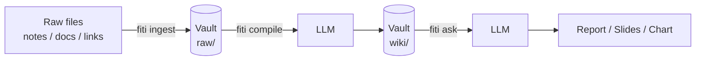
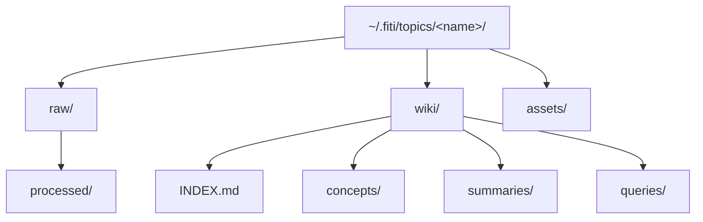
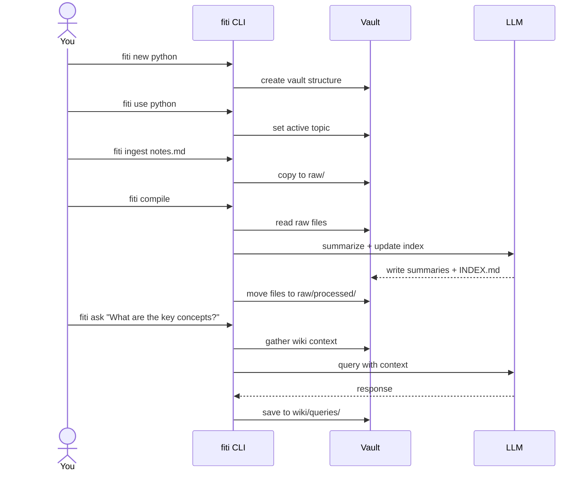
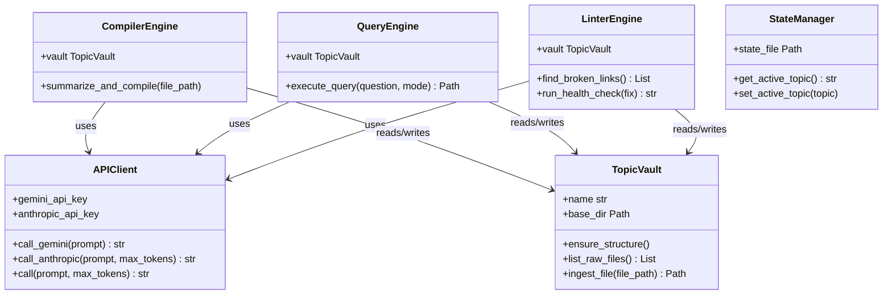

# Fiti

A Topic-Scoped LLM Knowledge CLI.

Organize your knowledge into explicit, namespaced **vaults**. Ingest raw notes, documents, and links — Fiti uses an LLM to automatically maintain a structured wiki inside each vault, ready to query.

---

## How it works



---

## Vault structure

Each vault lives at `~/.fiti/topics/<name>/`:



---

## Installation

```bash
pip install .
```

Requires Python 3.11+. No third-party dependencies — pure stdlib.

Set at least one API key:

```bash
export GEMINI_API_KEY=...       # preferred
export ANTHROPIC_API_KEY=...    # fallback
```

---

## Usage



### Commands

| Command | Description |
|---|---|
| `fiti new <topic>` | Create a new topic vault |
| `fiti use <topic>` | Switch the active topic |
| `fiti status` | Show active topic and pending files |
| `fiti ingest <file>` | Add a raw document to the active topic |
| `fiti compile` | Process uncompiled files with an LLM |
| `fiti ask "<question>"` | Query the wiki and save a response |
| `fiti ask --slides "<question>"` | Output as a Marp slide deck |
| `fiti ask --data "<question>"` | Output as a matplotlib chart script |
| `fiti lint` | Find broken wiki links *(PRO)* |
| `fiti lint --fix` | Auto-fix and rebuild the index *(PRO)* |

---

## Example

```bash
fiti new python
fiti use python

fiti ingest ~/notes/decorators.md
fiti ingest ~/notes/async_patterns.md

fiti compile
# -> Summaries written to wiki/summaries/
# -> INDEX.md updated with new concepts

fiti ask "Explain the difference between @staticmethod and @classmethod"
# -> Saved to wiki/queries/explain_the_difference_be_<ts>.md

fiti ask --slides "Give me an overview of async patterns"
# -> Saved as a Marp presentation
```

---

## Architecture



---

## LLM providers

Fiti prefers Gemini when both keys are set. All API calls use secure headers — no keys in URLs.

| Provider | Model | Set via |
|---|---|---|
| Google Gemini | `gemini-2.5-flash` | `GEMINI_API_KEY` |
| Anthropic Claude | `claude-3-5-sonnet-20241022` | `ANTHROPIC_API_KEY` |

---

## PRO features

The `lint` command requires a PRO license key:

```bash
export FITI_PRO_KEY=...
fiti lint
fiti lint --fix
```
