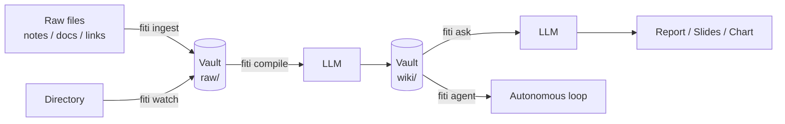
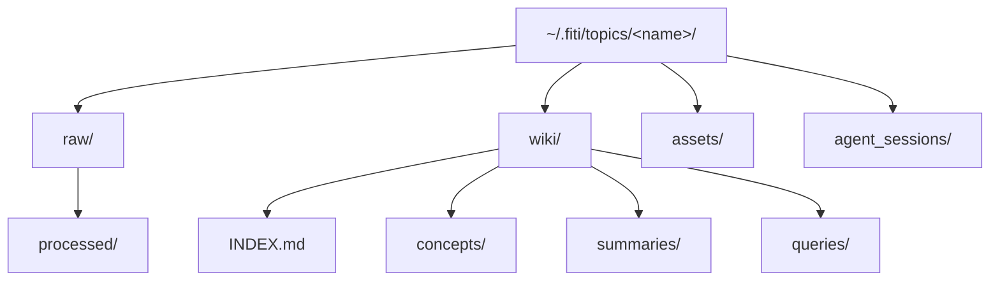
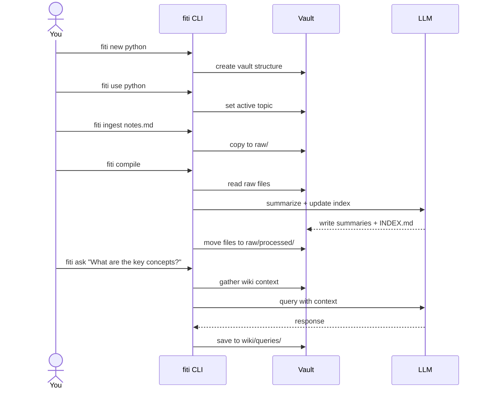

# Fiti

A Topic-Scoped LLM Knowledge CLI.

Organize your knowledge into explicit, namespaced **vaults**. Ingest raw notes, documents, and links — Fiti uses an LLM to automatically maintain a structured wiki inside each vault, ready to query.

---

## How it works



---

## Vault structure

Each vault lives at `~/.fiti/topics/<name>/`:



---

## Installation

```bash
pip install .
```

Requires Python 3.10+. No third-party dependencies — pure stdlib.

Set at least one API key:

```bash
export GEMINI_API_KEY=...       # preferred
export ANTHROPIC_API_KEY=...    # fallback
```

---

## Usage



### Commands

#### Vault management

| Command | Description |
|---|---|
| `fiti new <topic>` | Create a new topic vault |
| `fiti use <topic>` | Switch the active topic |
| `fiti list` | Show all vaults with stats and active marker |
| `fiti delete <topic>` | Delete a vault (asks for confirmation) |
| `fiti delete <topic> --yes` | Delete without confirmation prompt |
| `fiti status` | Show active topic and pending files |
| `fiti config` | Show effective configuration and config file path |

#### Knowledge pipeline

| Command | Description |
|---|---|
| `fiti ingest <file>` | Add a raw document to the active topic |
| `fiti compile` | Process uncompiled files with an LLM |
| `fiti compile --dry-run` | Preview what would be compiled without calling the LLM |
| `fiti watch <dir>` | Monitor a directory and auto-ingest new files |
| `fiti watch <dir> --compile` | Also compile each ingested file immediately |

#### Querying

| Command | Description |
|---|---|
| `fiti ask "<question>"` | Query the wiki and save a response |
| `fiti ask "<question>" --topics t1,t2` | Include extra vaults as context |
| `fiti ask --slides "<question>"` | Output as a Marp slide deck |
| `fiti ask --data "<question>"` | Output as a matplotlib chart script |
| `fiti search <keyword>` | Search wiki files without an LLM |
| `fiti search <keyword> --all` | Also search raw/ files |

#### Agentic mode

| Command | Description |
|---|---|
| `fiti agent "<goal>"` | Run an autonomous multi-step workflow |
| `fiti agent "<goal>" --max-steps N` | Limit tool-use iterations |
| `fiti agent "<goal>" --resume <id>` | Continue a prior session |
| `fiti agent --list-sessions` | List saved sessions for the active vault |

#### Maintenance *(PRO)*

| Command | Description |
|---|---|
| `fiti lint` | Find broken wiki links |
| `fiti lint --fix` | Auto-fix and rebuild the index |
| `fiti lint --dry-run` | Find broken links only — no LLM call or writes |

---

## Example

```bash
fiti new python
fiti use python

fiti ingest ~/notes/decorators.md
fiti ingest ~/notes/async_patterns.md

fiti compile
# [1/2] Compiling decorators.md... done
# [2/2] Compiling async_patterns.md... done
# Tokens: 1,204 in + 612 out = 1,816 total

fiti ask "Explain the difference between @staticmethod and @classmethod"
# Querying python (report)...
# Saved to: ~/.fiti/topics/python/wiki/queries/explain_the_difference_be_<ts>.md

fiti ask --topics python,rust "Compare error handling approaches"
# Querying python, rust (report)...

fiti agent "Summarise everything in the vault, then produce a slides deck on key patterns"
# fiti watch ~/Dropbox/notes --compile
```

---

## Configuration

Create `~/.fiti/config.json` to override defaults:

```json
{
    "anthropic_model": "claude-opus-4-6",
    "gemini_model": "gemini-2.5-pro",
    "timeout": 60,
    "retry_attempts": 5,
    "max_agent_steps": 20,
    "watch_interval": 10
}
```

| Key | Default | Description |
|---|---|---|
| `gemini_model` | `gemini-2.5-flash` | Gemini model name |
| `anthropic_model` | `claude-3-5-sonnet-20241022` | Anthropic model name |
| `timeout` | `30` | HTTP request timeout in seconds |
| `max_ingest_bytes` | `10485760` | Max file size for ingest (10 MB) |
| `max_tokens_compile` | `1024` | Max output tokens for compile calls |
| `max_tokens_query` | `2048` | Max output tokens for query calls |
| `max_agent_steps` | `10` | Max tool-use iterations per agent run |
| `retry_attempts` | `3` | Attempts before giving up on transient errors |
| `watch_interval` | `5` | Seconds between directory polls in `fiti watch` |

Run `fiti config` to see the current effective values.

---

## Architecture

```mermaid
classDiagram
    class APIClient {
        +gemini_api_key
        +anthropic_api_key
        +_session_usage dict
        +call(prompt, max_tokens) str
        +call_with_tools(messages, tools) dict
        +get_usage() dict
    }
    class FitiConfig {
        +gemini_model str
        +anthropic_model str
        +timeout int
        +retry_attempts int
        +watch_interval int
        +to_dict() dict
    }
    class CompilerEngine {
        +vault TopicVault
        +summarize_and_compile(file_path)
    }
    class QueryEngine {
        +vault TopicVault
        +execute_query(question, mode, extra_vaults) Path
    }
    class AgentExecutor {
        +vault TopicVault
        +list_sessions() list
        +run(goal, max_iterations, resume_id) str
    }
    class LinterEngine {
        +vault TopicVault
        +find_broken_links() List
        +run_health_check(fix) str
    }
    class TopicVault {
        +name str
        +base_dir Path
        +ensure_structure()
        +ingest_file(file_path) Path
        +locked() contextmanager
        +backup_index() Path
        +stats() dict
    }
    class StateManager {
        +get_active_topic() str
        +set_active_topic(topic)
    }

    CompilerEngine --> APIClient : uses
    QueryEngine --> APIClient : uses
    AgentExecutor --> APIClient : uses
    LinterEngine --> APIClient : uses
    CompilerEngine --> TopicVault : reads/writes
    QueryEngine --> TopicVault : reads/writes
    AgentExecutor --> TopicVault : reads/writes
    LinterEngine --> TopicVault : reads/writes
    APIClient --> FitiConfig : reads
```



---

## LLM providers

Fiti prefers Gemini when both keys are set. All API calls use secure headers — no keys in URLs. Transient network errors are retried with exponential backoff (2 s, 4 s, 8 s).

| Provider | Default model | Set via |
|---|---|---|
| Google Gemini | `gemini-2.5-flash` | `GEMINI_API_KEY` |
| Anthropic Claude | `claude-3-5-sonnet-20241022` | `ANTHROPIC_API_KEY` |

---

## PRO features

The `lint` command requires a PRO license key:

```bash
export FITI_PRO_KEY=...
fiti lint
fiti lint --fix
```
